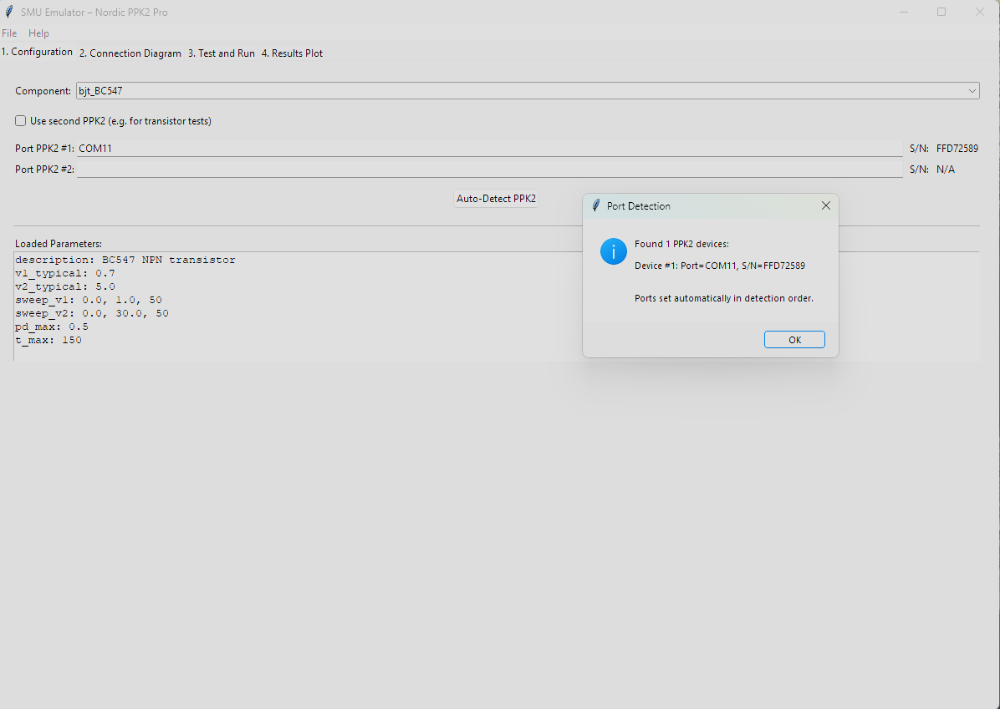

## Description
The new Nordic Semiconductor's [Power Profiler Kit II (PPK 2)](https://www.nordicsemi.com/Software-and-tools/Development-Tools/Power-Profiler-Kit-2) is very useful for real time measurement of device power consumption. The official [nRF Connect Power Profiler tool](https://github.com/NordicSemiconductor/pc-nrfconnect-ppk) provides a friendly GUI with real-time data display. However, there is no support for automated power monitoring. The purpose of this Python API is to enable automated power monitoring and data logging in Python applications.

Original description comes from webpage : https://docs.nordicsemi.com/bundle/ug_ppk2/page/UG/ppk/ppk_downloadable_content.html


## Overview

## Features
The main features of the PPK2 Python API (will) include:
* All nRF Connect Power Profiler GUI functionality - In progress
* Data logging to user selectable format - In progress
* Cross-platform support

## Requirements
Unlike the original Power Profiler Kit, the PPK2 uses Serial to communicate with the computer. No additional modules are required.

## Usage
At this point in time the library provides the basic API with a basic example showing how to read data and toggle DUT power.

To enable power monitoring in Source mode implement the following sequence:
```
ppk2_test = PPK2_API("/dev/ttyACM3")  # serial port will be different for you
ppk2_test.get_modifiers()
ppk2_test.use_source_meter()  # set source meter mode
ppk2_test.set_source_voltage(3300)  # set source voltage in mV
ppk2_test.start_measuring()  # start measuring

# read measured values in a for loop like this:
for i in range(0, 1000):
    read_data = ppk2_test.get_data()
    if read_data != b'':
        samples = ppk2_test.get_samples(read_data)
        print(f"Average of {len(samples)} samples is: {sum(samples)/len(samples)}uA")
    time.sleep(0.001)  # lower time between sampling -> less samples read in one sampling period
    
ppk2_test.stop_measuring()
```

## Multiprocessing version
Regular version will struggle to get all samples. Multiprocessing version spawns another process in the background which polls the device constantly for new samples and holds the last 10 seconds of data (default, configurable) in the buffer so get_data() can be called less frequently.

```
ppk2_test = PPK2_MP("/dev/ttyACM3")  # serial port will be different for you
ppk2_test.get_modifiers()
ppk2_test.use_source_meter()  # set source meter mode
ppk2_test.set_source_voltage(3300)  # set source voltage in mV
ppk2_test.start_measuring()  # start measuring

# read measured values in a for loop like this:
for i in range(0, 10):
    read_data = ppk2_test.get_data()
    if read_data != b'':
        samples = ppk2_test.get_samples(read_data)
        print(f"Average of {len(samples)} samples is: {sum(samples)/len(samples)}uA")
    time.sleep(1)  # we can do other stuff while the background process if fetching samples

ppk2_test.stop_measuring()

```

## Tools

### Battery Emulator GUI
The `ppk2_battery_emulator_gui.py` tool provides a graphical interface for emulating battery discharge profiles. It allows you to test your device's performance under different battery conditions.


To run the tool, execute the following command:
```
python tools/ppk2_battery_emulator_gui.py
```

The emulator supports two discharge curve behaviors:

*   **S-Curve (Real Emulation Mode):** This is the default mode and simulates a realistic battery discharge profile. It consists of three stages:
    1.  An initial rapid voltage drop (100% to 90% SoC).
    2.  A long, stable voltage plateau (90% to 20% SoC).
    3.  A final sharp voltage drop as the battery nears depletion (20% to 0% SoC).
    This mode is ideal for understanding how a device will perform with an actual battery over its entire discharge cycle.

*   **Linear V-SoC Curve (Test Mode):** In this mode, the voltage decreases linearly as the State of Charge (SoC) drops. This provides a predictable, straight-line voltage drop from the start voltage to the stop voltage, which is useful for simplified testing or for scenarios where a constant rate of voltage change is required.

### SMU PPK2 GUI
The `smu-ppk2-gui` is a graphical tool that emulates a two-channel Source/Measure Unit (SMU) using one or two Nordic PPK2s. This allows you to perform I-V curve tracing on various electronic components like diodes, transistors, and more. The tool can also export the collected data to a SPICE model for further simulation.



To install and run the tool, use the following commands:
```
cd tools/smu-ppk2-gui
pip install -r requirements.txt
python setup.py install
smu-gui
```

#### GUI Functions Overview

The SMU PPK2 GUI is organized into several tabs, guiding the user through the process of component characterization:

*   **1. Configuration:**
    *   **Component Selection:** Choose from a predefined list of components (e.g., LED, Diode, Transistor) to load specific test parameters.
    *   **Use second PPK2:** A checkbox to enable or disable the second PPK2 for two-port measurements (e.g., for transistors).
    *   **Port PPK2 #1 / #2:** Input fields for the serial ports of the connected PPK2 devices.
    *   **S/N:** Displays the serial number of the connected PPK2s.
    *   **Auto-Detect PPK2:** Automatically scans and populates the serial port fields with detected PPK2 devices.
    *   **Loaded Parameters:** A text area displaying the sweep parameters (voltage ranges, steps, delay) loaded for the selected component.

*   **2. Connection Diagram:**
    *   This tab dynamically displays a connection diagram based on the selected component and whether a second PPK2 is enabled, guiding the user on how to physically connect the component to the PPK2(s).

*   **3. Test and Run:**
    *   **Temp:** Displays the current temperature (if a sensor is available).
    *   **Start full test:** Initiates the I-V sweep measurement based on the configured parameters.

*   **4. Results Plot:**
    *   Displays the measured I-V characteristics graphically. The plot shows Voltage on the X-axis and Current on the Y-axis. If two PPK2s are used, both I-V curves will be plotted.

#### Exported Data Formats

The tool allows exporting measurement results in two formats:

*   **CSV File Format:**
    The CSV file contains the raw measurement data in a tabular format, suitable for analysis in spreadsheets or other data processing tools. The columns are:
    *   `V1 [V]`: Voltage measured by PPK2 #1 (Source/Measure Unit 1).
    *   `I1 [A]`: Current measured by PPK2 #1.
    *   `V2 [V]`: Voltage measured by PPK2 #2 (Source/Measure Unit 2), if enabled. Otherwise, 0.
    *   `I2 [A]`: Current measured by PPK2 #2, if enabled. Otherwise, 0.
    *   `Temp [°C]`: Temperature recorded during the measurement.
    *   `Power [mW]`: Calculated power (V1 * I1) in milliwatts.

*   **SPICE (.lib) File Format:**
    The SPICE `.lib` file generates a subcircuit model of the characterized component, which can be directly imported into SPICE simulators (e.g., LTSpice, ngspice). The model uses a Voltage-Controlled Current Source (G-source) with a Piecewise Linear (PWL) function to represent the measured I-V curve.

    The general structure of the `.lib` file is as follows:
    ```spice
    * SPICE Library Model for [Component Name] – Measured [Timestamp]
    * Model generated by PPK2 SMU Export Tool

    .SUBCKT [Component_Name_Sanitized] 1 2
    * G_MEAS implements the measured I(V) characteristic using a PWL function.
    * G_MEAS: Node 1 is the positive terminal, Node 2 is the negative terminal.
    * Control voltage is V(1, 2).
    G_MEAS 1 2 VALUE={
        + PWL(V(1, 2),
        +    [V_point_1], [I_point_1],
        +    [V_point_2], [I_point_2],
        +    ...
        +    [V_point_N], [I_point_N]
        + )
        }
    .ENDS [Component_Name_Sanitized]

    .lib [filename.lib] [Component_Name_Sanitized]
    ```
    Each `[V_point], [I_point]` pair corresponds to a measured voltage and current, allowing the SPICE simulator to accurately model the component's behavior based on the experimental data.

### What is a Source/Measure Unit (SMU)?
A Source/Measure Unit (SMU) is a highly versatile electronic test instrument that combines the capabilities of a precision voltage source, a precision current source, a voltage meter, and a current meter into a single, synchronized unit. This unique combination allows an SMU to simultaneously supply a voltage or current and measure the resulting current or voltage, respectively.

SMUs are indispensable in various applications, particularly in:

*   **I-V Characterization:** Performing current-voltage sweeps to understand the electrical behavior of components (e.g., diodes, transistors, resistors) and materials. This involves applying a range of voltages and measuring the corresponding currents, or vice-versa.
*   **Parametric Testing:** Precisely measuring critical electrical parameters of semiconductor devices, integrated circuits, and other electronic components to ensure they meet design specifications.
*   **Device and Materials Research:** Characterizing novel materials, sensors, and emerging electronic devices where precise control and measurement of electrical stimuli are crucial.
*   **Reliability Testing:** Stressing components with controlled electrical signals to evaluate their long-term performance and identify potential failure mechanisms.

Compared to separate instruments, an SMU offers superior synchronization between sourcing and measuring, higher accuracy, and often a wider dynamic range, making it ideal for sensitive measurements and automated test setups.

### PPK2 vs. Lab-Grade SMU Comparison

The following table provides a general comparison between the Nordic PPK2 and a typical lab-grade SMU like the Keysight B2900 series.

| Feature                  | Nordic PPK2                                       | Keysight B2900 Series (Lab SMU)                  |
| ------------------------ | ------------------------------------------------- | ------------------------------------------------ |
| **Primary Use Case**     | IoT device power profiling and debugging          | Precision DC characterization, test, and measurement |
| **Voltage Range**        | 0.8V to 5V (Source Mode)                          | Up to 210V                                       |
| **Current Range**        | 200nA to 1A                                       | Up to 3A (DC), 10.5A (pulsed)                    |
| **Resolution**           | ~100nA                                            | As low as 10fA / 100nV                           |
| **Sampling Rate**        | 100 kS/s                                          | Up to 200 kS/s                                   |
| **Accuracy**             | Good for typical IoT applications                 | High precision, suitable for characterization    |
| **Cost**                 | ~$100                                             | >$5,000                                          |
| **Portability**          | Highly portable, USB powered                      | Benchtop instrument                              |
| **Software**             | nRF Connect for Desktop, Python API               | Proprietary software, SCPI commands              |

## Licensing
pp2-api-python is licensed under [GPL V2 license](https://www.gnu.org/licenses/old-licenses/gpl-2.0.en.html).

What this means is that you can use this hardware and documentation without paying a royalty and knowing that you'll be able to use your version forever. You are also free to make changes but if you share these changes then you have to do so on the same conditions that you enjoy.

IRNAS is name and mark of Institute IRNAS. You may use these name and terms only to attribute the appropriate entity as required by the Open Licence referred to above. You may not use them in any other way and in particular you may not use them to imply endorsement or authorization of any hardware that you design, make or sell.
