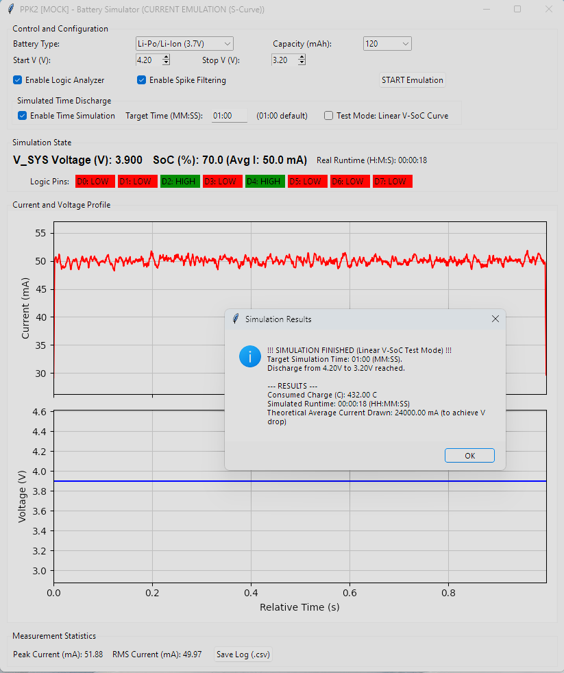

## Description
The new Nordic Semiconductor's [Power Profiler Kit II (PPK 2)](https://www.nordicsemi.com/Software-and-tools/Development-Tools/Power-Profiler-Kit-2) is very useful for real time measurement of device power consumption. The official [nRF Connect Power Profiler tool](https://github.com/NordicSemiconductor/pc-nrfconnect-ppk) provides a friendly GUI with real-time data display. However, there is no support for automated power monitoring. The purpose of this Python API is to enable automated power monitoring and data logging in Python applications.

Original description comes from webpage : https://docs.nordicsemi.com/bundle/ug_ppk2/page/UG/ppk/ppk_downloadable_content.html


## Overview

## Features
The main features of the PPK2 Python API (will) include:
* All nRF Connect Power Profiler GUI functionality - In progress
* Data logging to user selectable format - In progress
* Cross-platform support

## Requirements
Unlike the original Power Profiler Kit, the PPK2 uses Serial to communicate with the computer. No additional modules are required.

## Usage
At this point in time the library provides the basic API with a basic example showing how to read data and toggle DUT power.

To enable power monitoring in Source mode implement the following sequence:
```
ppk2_test = PPK2_API("/dev/ttyACM3")  # serial port will be different for you
ppk2_test.get_modifiers()
ppk2_test.use_source_meter()  # set source meter mode
ppk2_test.set_source_voltage(3300)  # set source voltage in mV
ppk2_test.start_measuring()  # start measuring

# read measured values in a for loop like this:
for i in range(0, 1000):
    read_data = ppk2_test.get_data()
    if read_data != b'':
        samples = ppk2_test.get_samples(read_data)
        print(f"Average of {len(samples)} samples is: {sum(samples)/len(samples)}uA")
    time.sleep(0.001)  # lower time between sampling -> less samples read in one sampling period
    
ppk2_test.stop_measuring()
```

## Multiprocessing version
Regular version will struggle to get all samples. Multiprocessing version spawns another process in the background which polls the device constantly for new samples and holds the last 10 seconds of data (default, configurable) in the buffer so get_data() can be called less frequently.

```
ppk2_test = PPK2_MP("/dev/ttyACM3")  # serial port will be different for you
ppk2_test.get_modifiers()
ppk2_test.use_source_meter()  # set source meter mode
ppk2_test.set_source_voltage(3300)  # set source voltage in mV
ppk2_test.start_measuring()  # start measuring

# read measured values in a for loop like this:
for i in range(0, 10):
    read_data = ppk2_test.get_data()
    if read_data != b'':
        samples = ppk2_test.get_samples(read_data)
        print(f"Average of {len(samples)} samples is: {sum(samples)/len(samples)}uA")
    time.sleep(1)  # we can do other stuff while the background process if fetching samples

ppk2_test.stop_measuring()

```

## Tools

### Battery Emulator GUI
The `ppk2_battery_emulator_gui.py` tool provides a graphical interface for emulating battery discharge profiles. It allows you to test your device's performance under different battery conditions.



To run the tool, execute the following command:
```
python tools/ppk2_battery_emulator_gui.py
```

The emulator supports two discharge curve behaviors:

*   **S-Curve (Real Emulation Mode):** This is the default mode and simulates a realistic battery discharge profile. It consists of three stages:
    1.  An initial rapid voltage drop (100% to 90% SoC).
    2.  A long, stable voltage plateau (90% to 20% SoC).
    3.  A final sharp voltage drop as the battery nears depletion (20% to 0% SoC).
    This mode is ideal for understanding how a device will perform with an actual battery over its entire discharge cycle.

*   **Linear V-SoC Curve (Test Mode):** In this mode, the voltage decreases linearly as the State of Charge (SoC) drops. This provides a predictable, straight-line voltage drop from the start voltage to the stop voltage, which is useful for simplified testing or for scenarios where a constant rate of voltage change is required.


### SMU - Precision Source/Measure Units
Future python script to combine two PPK2 unit to make a measurement like two port SMU for measure small active/ passive components like LED Diode, Small signal transistor

### PPK2 vs. Lab-Grade SMU Comparison

While the PPK2 is an excellent tool for many power profiling applications, it's important to understand its capabilities in comparison to a lab-grade Source/Measure Unit (SMU) like the Keysight B2900 series.

| Feature                  | Nordic PPK2                                       | Keysight B2900 Series (Lab SMU)                  |
| ------------------------ | ------------------------------------------------- | ------------------------------------------------ |
| **Primary Use Case**     | IoT device power profiling and debugging          | Precision DC characterization, test, and measurement |
| **Voltage Range**        | 0.8V to 5V (Source Mode)                          | Up to 210V                                       |
| **Current Range**        | 200nA to 1A                                       | Up to 3A (DC), 10.5A (pulsed)                    |
| **Resolution**           | ~100nA                                            | As low as 10fA / 100nV                           |
| **Sampling Rate**        | 100 kS/s                                          | Up to 200 kS/s                                   |
| **Accuracy**             | Good for typical IoT applications                 | High precision, suitable for characterization    |
| **Cost**                 | ~$100                                             | >$5,000                                          |
| **Portability**          | Highly portable, USB powered                      | Benchtop instrument                              |
| **Software**             | nRF Connect for Desktop, Python API               | Proprietary software, SCPI commands              |

## Licensing
pp2-api-python is licensed under [GPL V2 license](https://www.gnu.org/licenses/old-licenses/gpl-2.0.en.html).

What this means is that you can use this hardware and documentation without paying a royalty and knowing that you'll be able to use your version forever. You are also free to make changes but if you share these changes then you have to do so on the same conditions that you enjoy.

IRNAS is name and mark of Institute IRNAS. You may use these name and terms only to attribute the appropriate entity as required by the Open Licence referred to above. You may not use them in any other way and in particular you may not use them to imply endorsement or authorization of any hardware that you design, make or sell.
